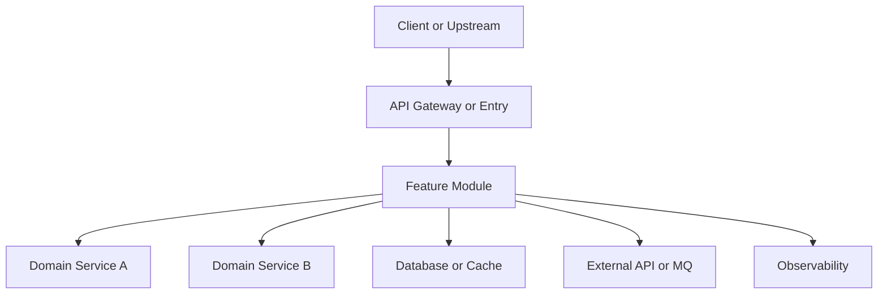
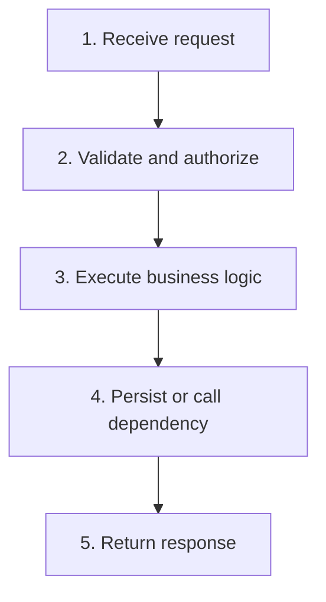
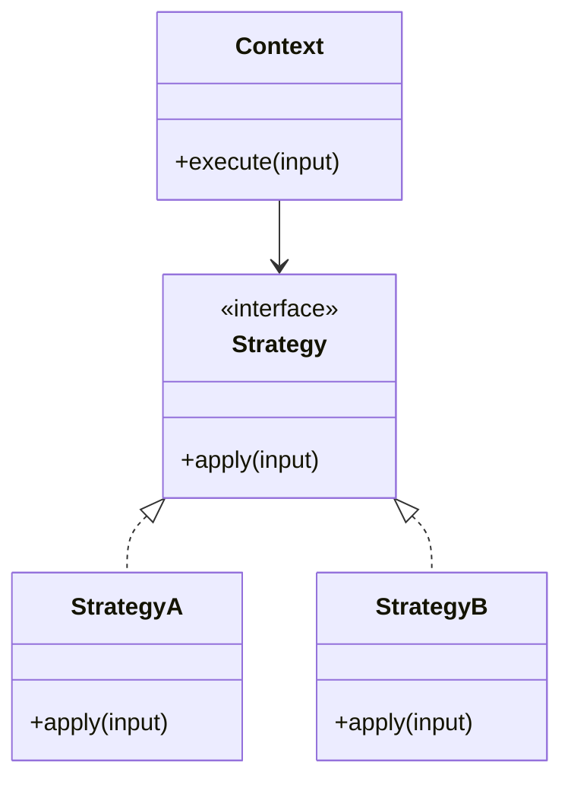
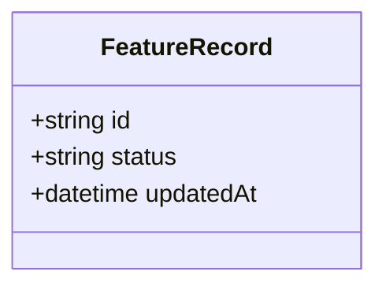
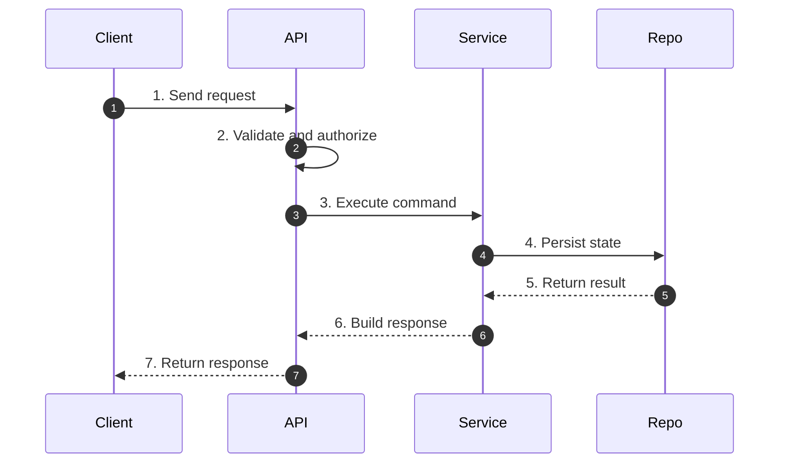
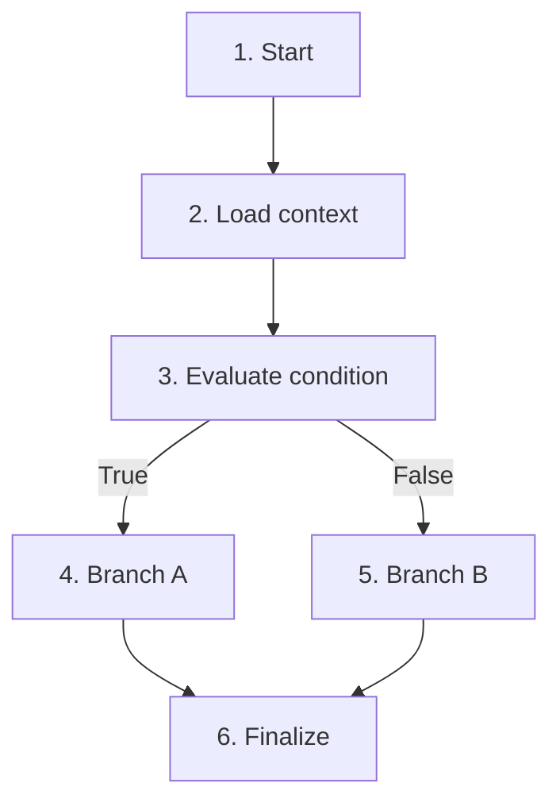

# [Feature Name] Design Document

## 1. Background

### 1.1 Functional Introduction

- **Goal**: [One-sentence feature goal]
- **Background (Why implement this)**: [Why this feature is needed now, e.g., customer requirement, epic decomposition dependency, compliance/business requirement]

### 1.2 Scope, Non-goals, and Pain Points

| Item | Content |
|------|---------|
| In Scope | [What this feature covers] |
| Out of Scope | [Explicit non-goals] |
| Current Pain | [Current issue and impact] |
| Success Metric | [How success is measured] |

### 1.3 Use Cases

| Actor | Trigger | Expected Result |
|------|---------|-----------------|
| [User/System] | [When this happens] | [What should happen] |

## 2. High-Level Design

Show where this feature sits in the whole system, how it runs, and how it interacts with adjacent components.

Include in this chapter:
- **System position**: feature boundary and nearby upstream/downstream components
- **Runtime operation**: core mechanism (flow-based or non-flow-based)
- **Component interactions**: direction, protocol, critical contract, and failure handling

### 2.0 System Context & Position



After the diagram, add **2-4 bullets** describing:
- Feature boundary (what is inside/outside this feature)
- Upstream trigger sources and downstream dependencies
- Why this placement is chosen (coupling, ownership, performance, security, etc.)

### 2.1 Module Breakdown

| Module | Responsibility | Inputs | Outputs |
|--------|----------------|--------|---------|
| [Module A] | [Core responsibility] | [Key input] | [Key output] |
| [Module B] | [Core responsibility] | [Key input] | [Key output] |

### 2.1.1 Interaction Matrix

| From | To | Type | Contract/Protocol | Failure Handling |
|------|----|------|-------------------|------------------|
| [Feature Entry] | [Core Service] | [Sync/Async] | [Method/API/Event] | [timeout/retry/fallback] |
| [Core Service] | [Storage/External] | [Sync/Async] | [SQL/HTTP/RPC/MQ] | [idempotency/circuit breaker] |

### 2.2 Core Mechanism

Choose one mode based on feature nature:
- **Flow Mode**: for request/event-driven sequential execution.
- **Mechanism Mode**: for non-flow-centric design (pattern, strategy, state model, policy engine, plugin architecture, etc.).

#### Option A: Flow Mode



After the Mermaid diagram, add a brief explanation of **this exact flow** (before Chapter 4 details):

- Use **2-5 bullets**, one sentence each, high information density.
- Explain the diagram step-by-step (or merged adjacent steps), not a separate abstract summary.
- Each bullet should include concrete component/action/data-state change and key constraints when relevant.

Example format (mapped to the diagram above):
- `1 -> 2`: Request enters via [entry], then [validation/auth] gates execution and rejects invalid input with [error type].
- `3`: [core module] applies [business rule/decision], produces [intermediate state/output], and triggers [dependency call].
- `4`: [repository/external service] persists or fetches [data], with [idempotency/concurrency/retry] guard.
- `5`: [API/application layer] maps [domain result/error] to [response/event], and records [logs/metrics/traces].

#### Option B: Mechanism Mode

Use a structure diagram that best fits the design (e.g., classDiagram, graph, stateDiagram):



After the Mermaid diagram, add a brief explanation of **this exact mechanism**:

- Use **2-5 bullets**, one sentence each, high information density.
- Explain role relations and runtime collaboration from the diagram, not generic pattern theory.
- Each bullet should include concrete component/responsibility/selection rule/state effect/extension constraint.

Example format (mapped to the diagram above):
- `Context -> Strategy`: `Context.execute` delegates decision logic to `Strategy.apply`, keeping entry logic stable.
- `StrategyA / StrategyB`: each implementation encapsulates one rule set and returns unified output contract `[Result]`.
- `Selection rule`: choose concrete strategy by `[feature flag/config/input predicate]`, resolved at `[factory/composition root]`.
- `Extension point`: adding `StrategyC` requires no `Context` change if interface and contract invariants are preserved.

### 2.3 Directory Structure *(Conditional)*
Only include when introducing multiple files or structural changes.

```text
src/
  feature/
    service/
      feature_service.ts            # NEW
    repository/
      feature_repository.ts         # MODIFIED
  api/
    feature_controller.ts           # MODIFIED
```

## 3. Data Model / API Design *(Optional)*
Omit if no data shape/API contract changes.

### 3.1 Data Structures
| Entity | Change Type | Fields / Rules | Compatibility |
|--------|-------------|----------------|---------------|
| [Entity] | [NEW/MODIFIED/DELETED] | [Fields, constraints] | [Backward impact] |



### 3.2 API Design
| API | Method | Request | Response | Errors |
|-----|--------|---------|----------|--------|
| [/v1/feature] | [POST] | [Required fields] | [Result shape] | [400/401/409/500] |

```text
POST /v1/feature
Request: { ... }
Response: { ... }
Error: { code, message, details }
```

## 4. Detailed Design

For each flow/module subsection:
1. Provide Mermaid diagram with numbered steps.
2. Provide numbered explanation matching diagram numbers.
3. Include happy path and key failure paths.

**Rule**: Chapter 4 and Chapter 5 subsections MUST map one-to-one by number and name.

### 4.1 Flow/Module 1: [Name]



**Flow Explanation:**
1. **Send request**: [Trigger, required fields, idempotency key if needed].
2. **Validate and authorize**: [Validation rules, authz conditions, reject cases].
3. **Execute command**: [Core decision logic, branch criteria].
4. **Persist state**: [Write/read details, transaction boundaries].
5. **Return result**: [Expected repository output and invariants].
6. **Build response**: [Mapping and masking rules].
7. **Return response**: [Status code and payload].

**Failure Paths:**
- [Case A]: [Condition] -> [Error code / handling].
- [Case B]: [Condition] -> [Retry / compensation / fallback].

**Acceptance Criteria:**
- [Observable behavior 1]
- [Observable behavior 2]

### 4.2 Flow/Module 2: [Name]



**Flow Explanation:**
1. **Start**: [Entry trigger].
2. **Load context**: [Dependencies/config loaded].
3. **Evaluate condition**: [Decision inputs and rules].
4. **Branch A**: [Actions and side effects].
5. **Branch B**: [Actions and side effects].
6. **Finalize**: [Cleanup/emit events/update state].

**Failure Paths:**
- [Case A]: [Condition] -> [Handling].

**Acceptance Criteria:**
- [Observable behavior]

## 5. Implementation Changes

Show **where** to change with skeletons and describe **what** to change concisely in user's natual language.

**Subsection numbers and names MUST match Chapter 4 exactly.**

**Markers:**
- `// NEW: <file-path>`
- `// MODIFIED: <file-path>`
- `// MOVED: <old-path> -> <new-path>`
- `// RENAMED: <old-name> -> <new-name>`
- `// ...existing...`
- `// @before: <code>` / `// @after: <code>`
- `// + <description>`
- `// ~ <old> -> <new>`
- `// - <description>`

### 5.1 Flow/Module 1: [Name]

> [One-line summary]

```text
// MODIFIED: src/api/feature_controller.ts
class FeatureController {
  handle(req) {
    // ...existing...
    // + Validate required fields and auth scope
    // + Forward command with idempotency key
    // + Map domain result to API response
  }
}
```

```text
// NEW: src/feature/service/feature_service.ts
class FeatureService {
  execute(command) {
    // + Apply business rules and branch decisions
    // + Enforce idempotency and ordering constraints
    // + Persist through repository with transaction boundary
  }
}
```

```text
// MODIFIED: src/feature/repository/feature_repository.ts
class FeatureRepository {
  save(record) {
    // ~ write(record) -> writeWithVersionCheck(record)
    // + Emit structured error when conflict occurs
  }
}
```

### 5.2 Flow/Module 2: [Name]
> [One-line summary]

```text
// MODIFIED: src/feature/processor/feature_processor.ts
class FeatureProcessor {
  process(input) {
    // + Load runtime config and guards
    // + Route to branchA / branchB by condition
    // + Record metrics and trace tags
  }
}
```

## 6. Implementation Plan

(Break down the design into actionable steps/phases. Consider:

- For simple features: just list tasks without phases
- For larger features: use phases, Phase 1 for foundation/prerequisites
- Mark dependencies only when they exist
- Prioritize by importance: P0=Must have, P1=Should have, P2=Nice to have)

### Simple Feature Example:

<!--
The following two examples are guidance for choosing the right format.
Do NOT output these headers ("Simple Feature Example" / "Larger Feature Example") in the actual document.
Pick the format that fits the feature's complexity.
-->
| Task | Priority | Description |
|------|----------|-------------|
| 1. [Task Name] | P0 | [Brief description] |
| 2. [Task Name] | P0 | [Brief description] |
| 3. [Task Name] | P1 | [Brief description] |

### Larger Feature Example:

#### Phase 1: Foundation
> Goal: [Phase goal]

| Task | Priority | Description |
|------|----------|-------------|
| 1.1 [Task Name] | P0 | [Brief description] |

#### Phase 2: Core Features
> Depends on: Phase 1

| Task | Priority | Description |
|------|----------|-------------|
| 2.1 [Task Name] | P0 | [Brief description] |