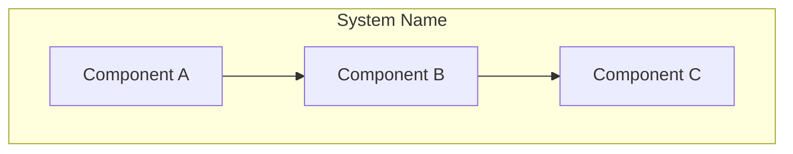
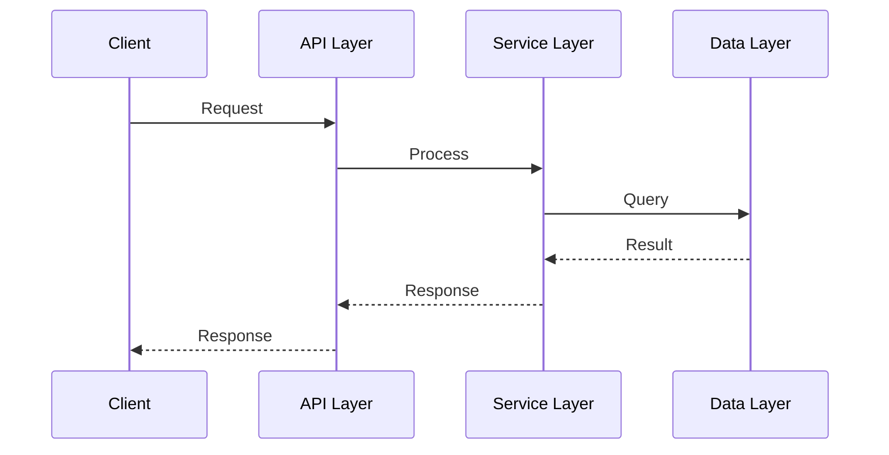

# architecture.md Template

```markdown
# Architecture Design

## System Overview



**Source**: Based on analysis of `[key_files]`

## Directory Structure

```
project-root/
├── src/
│   ├── [module1]/    # [responsibility]
│   ├── [module2]/    # [responsibility]
│   └── [module3]/    # [responsibility]
├── config/           # Configuration files
└── tests/            # Test suites
```

## Module Architecture

### [Module Name]

**Purpose**: [What this module does]
**Location**: `[path/to/module]`

**Key Components**:
| Component | Responsibility | Source |
|-----------|---------------|--------|
| [Class/Function] | [What it does] | `[file:line]` |

**Dependencies**:
- [Internal]: `[module_name]`
- [External]: `[package_name]`

## Data Flow



## Design Patterns

| Pattern | Implementation | Source |
|---------|---------------|--------|
| [Pattern Name] | [Where/How used] | `[file:line]` |

## External Integrations

| Service | Purpose | Source |
|---------|---------|--------|
| [Service Name] | [What it does] | `[file:line]` |
```
